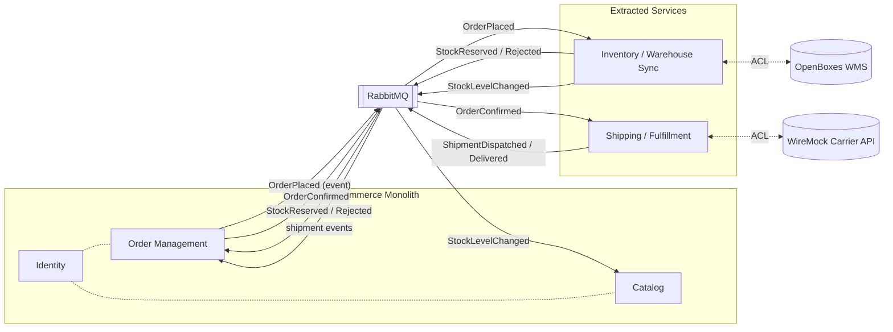

# Context Map

**Scenario:** C — Omnichannel Commerce Core (VerdeMart Retail)
**Author:** Person 2 · **Status:** DRAFT v2 · **Due:** 29 Apr 2026
**Grounded in:** [docs/shared/nopcommerce-context-pack.md](../shared/nopcommerce-context-pack.md)
**See also:** [bounded-contexts.md](bounded-contexts.md) · [quality-attribute-scenarios.md](quality-attribute-scenarios.md) · [README.md](README.md)

---

## 1. Context Map

## 2. Relationship patterns (DDD)

| Upstream | Downstream | Pattern | Reason |
|----------|------------|---------|--------|
| Inventory | Order Management | **Published Language** (events) | Async, decouples order acceptance from stock truth |
| Inventory | Catalog | Published Language | Catalog projects stock visibility from the event stream |
| Order Management | Shipping | Published Language | Shipping reacts to confirmed orders only |
| OpenBoxes | Inventory service | **Anti-Corruption Layer** | Inventory service translates OpenBoxes' model into our published language; isolates schema drift |
| WireMock carrier | Shipping service | **ACL** | Shipping service hides carrier-specific quirks and failure modes |
| Identity | Catalog, Order Mgmt | **Conformist** (internal) | Identity stays as-is; no rework to keep scope tight |

## 3. Data ownership rules

- **No shared database** across the monolith / extracted-service line. nopCommerce keeps its SQL Server; Inventory owns its store; Shipping owns its store.
- Catalog's stock view is a **read model** rebuilt from `StockLevelChanged` events. It is allowed to be stale (see [QA-2](quality-attribute-scenarios.md#qa-2--consistency-stock-visibility)).
- Order state is owned by Order Management. Inventory and Shipping mirror only what they need to do their job.

## 4. The architectural seam we are introducing

The **transactional outbox** is what makes the published-language relationships above safe. Today, [`EntityRepository.InsertAsync` (lines 341-350)](../../nopCommerce/src/Libraries/Nop.Data/EntityRepository.cs#L341) commits to the database and *then* publishes the event in a separate step — a classic dual-write. [`OrderPlacedEvent` is published at `OrderProcessingService.cs:1617`](../../nopCommerce/src/Libraries/Nop.Services/Orders/OrderProcessingService.cs#L1617), **after** the order has been committed. If the consumer that bridges to RabbitMQ fails after the commit, the order exists in nopCommerce but the warehouse is never told. The outbox closes that gap and is the seam through which all cross-context messages flow.
