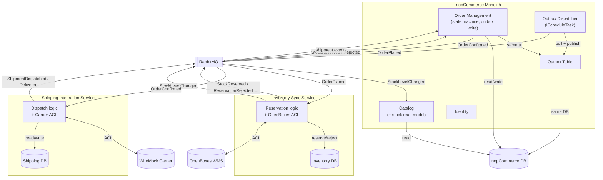

# Target Architecture

**Scenario:** C — Omnichannel Commerce Core (VerdeMart Retail)
**Author:** Person 3 · **Status:** DRAFT v1
**Produced by:** ADD iterations 1–3 — see [add-framework.md](add-framework.md) for reasoning

---

## Architecture Diagram

---

## What Stays in the Monolith

**Order Management** — the order state machine is deeply coupled to payment, customer, and notification services inside nopCommerce. Extracting it would mean replicating half of `Nop.Services`. Instead, we evolve it in place: make states explicit, add `Compensated`, and decouple from inventory via the outbox.

**Catalog** — read-heavy, low scenario pressure. The stock read model is a local projection updated by events from the Inventory service. Keeping it inside avoids an extra network hop on every product page.

**Identity** — stays as-is. Federated SSO across channels is an honest scope cut; it doesn't drive any of our QA scenarios.

## What's Extracted

**Inventory Sync Service** — owns stock truth, reservations, and the OpenBoxes integration. Separate process, separate database. The boundary exists because inventory has a different failure domain (warehouse goes down, orders should still be accepted) and the assignment prohibits shared databases across extracted boundaries.

**Shipping Integration Service** — owns carrier dispatch and tracking. Separate process, separate database. Isolated because carrier degradation (slow WireMock responses, 5xx) must not block order confirmation or stock operations.

## Cross-Cutting Concerns

- **Correlation ID** — generated at order placement, propagated through outbox messages and RabbitMQ headers. Every service logs it, making end-to-end tracing possible (drives QA-5).
- **Idempotency** — outbox dispatcher uses a message ID for deduplication. Consumers use event IDs to prevent double-processing on redelivery.
- **Dead-letter queue** — messages that fail after retries land in a RabbitMQ DLQ for manual inspection, rather than being silently dropped.
